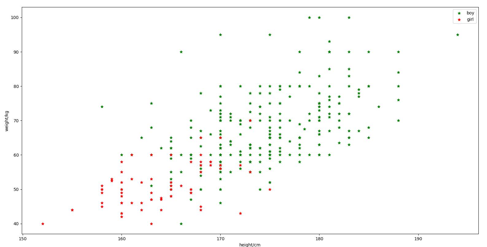
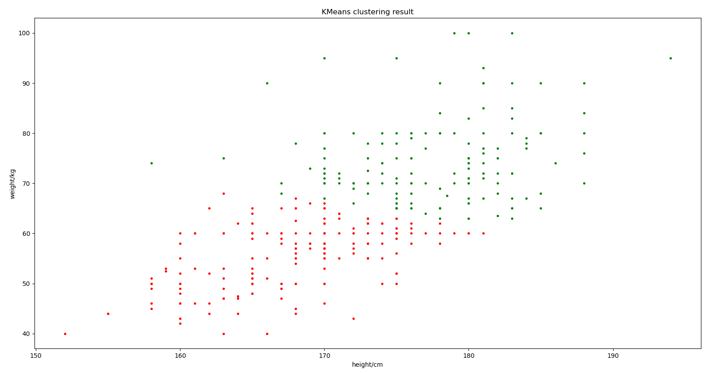
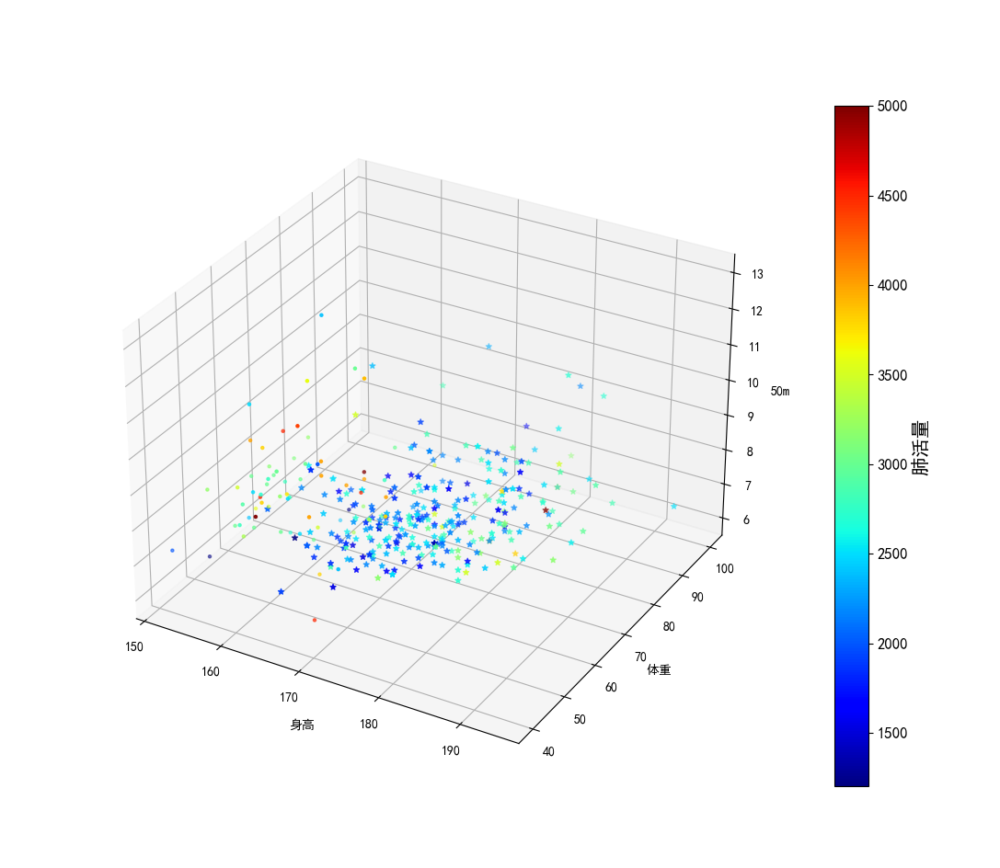
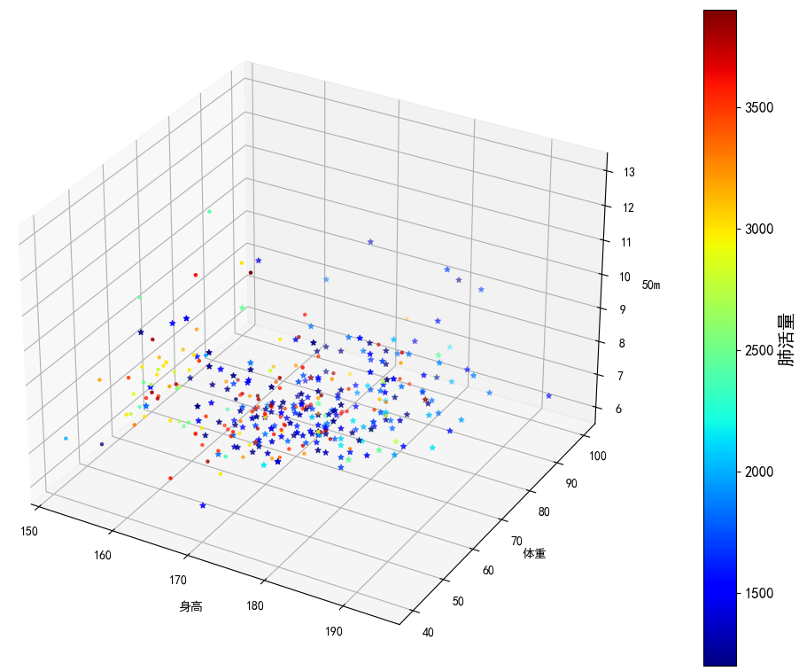
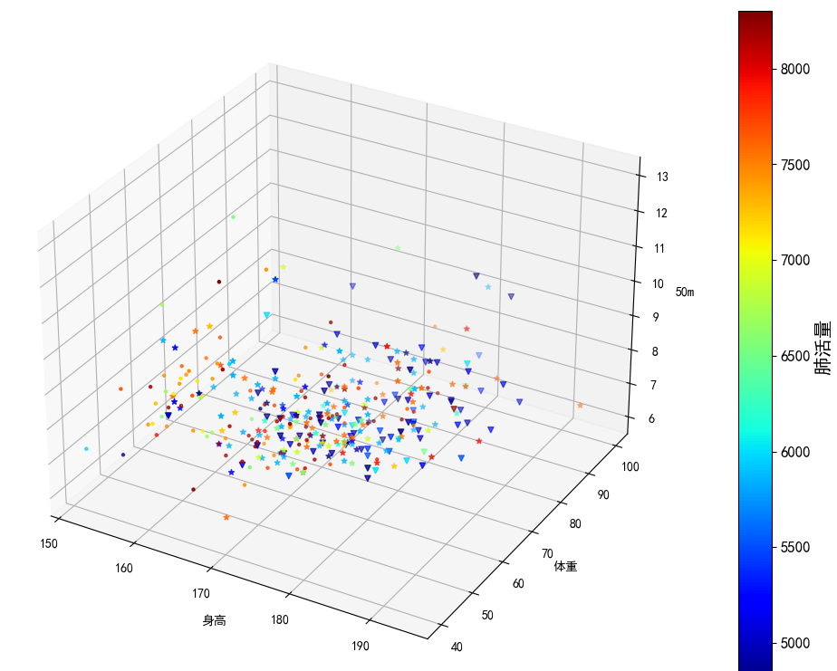
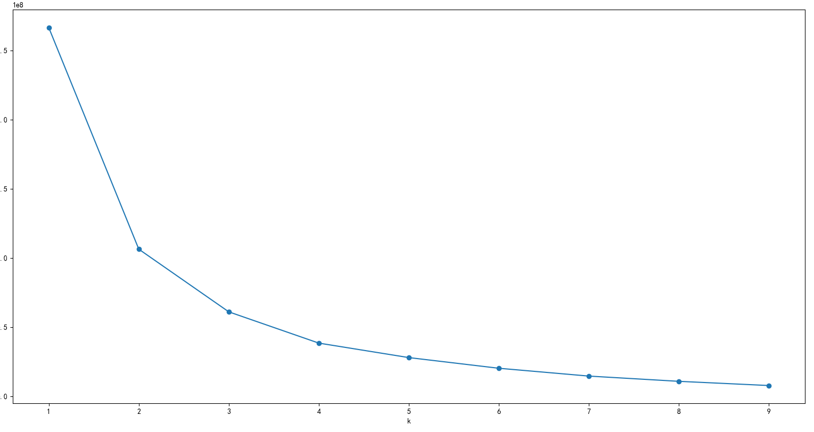

## 模式识别与机器学习第二次作业

### 孙佳伟-202122060713


### 1.   采用C均值聚类算法对男女生样本数据中的身高、体重、50m成绩、肺活量4个特征进行聚类分析，考察不同的类别初始值以及类别数对聚类结果的影响，并以友好的方式图示化结果。

k-mean算法如下

LLoyd’s algorithm is iterative and decomposes the k-means problem into two distinct, alternating steps: the *assignment* step and the *update* step. The full algorithm can be described in pseudocode as follows:

1. Given cluster centroids μiμi initialized in some way,
2. For iteration $t=1..T$:
   1. Compute the distance from each point xx to each cluster centroid μμ,
   2. Assign each point to the centroid it is closest to,
   3. Recompute each centroid μ as the mean of all points assigned to it,

where T is the number of iterations we wish to run this algorithm for (typically a few hundred). In each iteration, (1) and (2) are the assignment step and (3) is the update step. The time complexity of this approach is $O(n×k×T)$. As you can see, this algorithm is very straightforward and simple. I’d like to emphasize that the first step, cluster initialization, is very important too and bad initialization can delay proper convergence by many iterations. 

下面是`k-mean`算法的伪代码

```c++
输入:样本集D={x_1,x_2,...,x_n};聚类簇数c
过程：
1:从D中随机选择c个样本作为初始均值向量{u_1，u_2,...,u_c}
2:repeat
3:令C_i=Ø(1≤i≤c)
4:for j = 1,...,n do
5:  计算样本x_j与各均值向量u_i(1≤i≤c)的距离：d_ji = ||x_j-u_i||2;
6:  根据距离最近的均值向量将x_j归入该簇
7:end for
8:for i = 1,...,c do
9:  计算新的均值向量u'_i
10: if u'_i ≠ u_i then
11:    将当前均值向量u_i更新为u'_i
12：   else
13:    保持当前均值向量不变
14：   end if
15:end for
16:until 当前所有均值向量不再更新
17：return 簇划分结果
输出：簇划分C={C_1,C_2,...,C_c}
```

本次聚类的样本`x`是一个四维的特征，先把四维特征提取出来，并且做一个展示，由于四维数据不便于展示，二维数据在空间中是一个点，三维数据在空间中有三维坐标，四维就很难可视化展示，先做一个关于二维的身高体重，直观验证一下k-mean算法

先画出男女生身高和体重分布的散点图，直观的展示一下聚类前的分布



下面使用`sklearn`库中的k-mean算法，先对数据进行聚类，聚类数为2

```python
# 聚类数为2
kmeans_n_clusters = 2
# 构造聚类器,聚类数为2
# kmeans_clusterer = KMeans(kmeans_n_clusters)
kmeans_clusterer = KMeans(n_clusters=kmeans_n_clusters, init='random', n_init=1)
# 训练聚类
kmeans_clusterer.fit(x_h_w)

kmeans_cluster_label = kmeans_clusterer.labels_  # 获取聚类标签
# print('kmeans_label_pred:',kmeans_cluster_label)
kmeans_cluster_center = kmeans_clusterer.cluster_centers_  # 获取聚类中心
# print('kmeans_cluster_center:',kmeans_cluster_center)
kmeans_inertia = kmeans_clusterer.inertia_  # 获取聚类准则的总和
# print('kmeans_inertia:',kmeans_inertia)

# 绘图，显示聚类结果
plt.figure(2)
plt.clf()
# markers = ['^', 'x', 'o', '*', '+']
colours = ['g', 'r', 'b', 'y', 'c']
# class_label   = ['Class 1','Class 2','Class 3','Class 4','Class 5','center']
class_label = ['Class 1', 'Class 2', 'Class 3', 'center']
for i in range(kmeans_n_clusters):
    kmeans_members = kmeans_cluster_label == i
    plt.scatter(x_h_w[kmeans_members, 0], x_h_w[kmeans_members, 1], s=30, c=colours[i], marker='.')
# plt.legend(class_label,loc=0)
plt.title('KMeans clustering result')
plt.xlabel('height/cm')
plt.ylabel('weight/kg')
plt.show()
```

聚类结果如下：



接下来根据k-mean算法的算法步骤和伪代码，我们自己实现k-mean算法。

```python
def k_means(data, k, number_of_iterations):
    n = len(data)
    number_of_features = data.shape[1]
    # Pick random indices for the initial centroids.
    initial_indices = np.random.choice(range(n), k)
    # We keep the centroids as |features| x k matrix.
    means = data[initial_indices].T
    # To avoid loops, we repeat the data k times depthwise and compute the
    # distance from each point to each centroid in one step in a
    # n x |features| x k tensor.
    repeated_data = np.stack([data] * k, axis=-1)
    all_rows = np.arange(n)
    zero = np.zeros([1, 1, 2])
    for _ in range(number_of_iterations):
        # Broadcast means across the repeated data matrix, gives us a
        # n x k matrix of distances.
        distances = np.sum(np.square(repeated_data - means), axis=1)
        # Find the index of the smallest distance (closest cluster) for each
        # point.
        assignment = np.argmin(distances, axis=-1)
        # Again to avoid a loop, we'll create a sparse matrix with k slots for
        # each point and fill exactly the one slot that the point was assigned
        # to. Then we reduce across all points to give us the sum of points for
        # each cluster.
        sparse = np.zeros([n, k, number_of_features])
        sparse[all_rows, assignment] = data
        # To compute the correct mean, we need to know how many points are
        # assigned to each cluster (without a loop).
        counts = (sparse != zero).sum(axis=0)
        # Compute new assignments.
        means = sparse.sum(axis=0).T / counts.clip(min=1).T
    return means.T
```

**接下来完成本次作业要求的内容，采用四维数据，身高-体重-50m-肺活量，来进行k均值聚类** 

***首先，为了直观的展示数据，我们先将男生女生的散点图画出来，采用四维散点图来显示数据，x-y-z，第四维使用颜色深度来展示，使用不同的形状来区分类别***。

```python
fig = plt.figure(3)  # 创建一个图
plt.rcParams['font.sans-serif'] = ['SimHei']
ax = fig.add_subplot(111, projection='3d')

X, Y, Z = man_x_h_w_50m_f[:, 0], man_x_h_w_50m_f[:, 1], man_x_h_w_50m_f[:, 2]  # 给X,Y,Z赋值ndarray数组, 分别为C0*, w, y
x1, y1, z1 = faman_x_h_w_50m_f[:, 0], faman_x_h_w_50m_f[:, 1], faman_x_h_w_50m_f[:, 2]

cm = plt.cm.get_cmap('jet')  # 颜色映射，为jet型映射规则

fig = ax.scatter3D(X, Y, Z, c=man_x_h_w_50m_f[:, 3], cmap=cm, marker='*')
fig = ax.scatter3D(x1, y1, z1, c=faman_x_h_w_50m_f[:, 3], cmap=cm, marker='.')

cb = plt.colorbar(fig)  # 设置坐标轴
ax.set_xlabel('身高')
ax.set_ylabel('体重')
ax.set_zlabel('50m')
cb.ax.tick_params(labelsize=12)
cb.set_label('肺活量', size=15)
```

绘画结果如下，`‘*’`表示男生，`‘.’`表示女生

图可能不是非常的清楚，文章地址：https://github.com/sinary-sys/pattern_recognition/tree/master/second_work

下面对四维数据进行k-mean聚类，

```python
# 聚类数为2
kmeans_n_clusters = 2
# 构造聚类器,聚类数为2
# kmeans_clusterer = KMeans(kmeans_n_clusters)
kmeans_clusterer = KMeans(n_clusters=kmeans_n_clusters, init='random', n_init=1)
# 训练聚类
kmeans_clusterer.fit(x_h_w_50m_f)

kmeans_cluster_label = kmeans_clusterer.labels_  # 获取聚类标签
# print('kmeans_label_pred:',kmeans_cluster_label)
kmeans_cluster_center = kmeans_clusterer.cluster_centers_  # 获取聚类中心
# print('kmeans_cluster_center:',kmeans_cluster_center)
kmeans_inertia = kmeans_clusterer.inertia_  # 获取聚类准则的总和
# print('kmeans_inertia:',kmeans_inertia)
fig1 = plt.figure(4)  # 创建一个图
plt.rcParams['font.sans-serif'] = ['SimHei']
ax1 = fig1.add_subplot(111, projection='3d')

kmeans_members = kmeans_cluster_label == 0
s0 = x_h_w_50m_f[kmeans_members]  # 给X,Y,Z赋值ndarray数组, 分别为C0*, w, y
kmeans_members = kmeans_cluster_label == 1
s1 = x_h_w_50m_f[kmeans_members]  # 给X,Y,Z赋值ndarray数组, 分别为C0*, w, y

cm1 = plt.cm.get_cmap('jet')  # 颜色映射，为jet型映射规则

fig1 = ax1.scatter3D(s0[:, 0], s0[:, 1], s0[:, 2], c=s0[:, 3], cmap=cm1, marker='*')
fig1 = ax1.scatter3D(s1[:, 0], s1[:, 1], s1[:, 2], c=s1[:, 3], cmap=cm1, marker='.')

cb1 = plt.colorbar(fig1)  # 设置坐标轴
ax1.set_xlabel('身高')
ax1.set_ylabel('体重')
ax1.set_zlabel('50m')
cb1.ax.tick_params(labelsize=12)
cb1.set_label('肺活量', size=15)

plt.show()
```

聚类结果如下：




接下来将模型聚类为三类：



接下来确定最优聚类数：

```python
#确定最优聚类数，将将结果可视化

plt.figure(6)  # 创建一个图
inertia_Je = []
k = []
#簇的数量
for n_clusters in range(1,10):
    cls = KMeans(n_clusters).fit(x_h_w_50m_f)
    inertia_Je.append(cls.inertia_)
    k.append(n_clusters)
plt.scatter(k, inertia_Je)
plt.plot(k, inertia_Je)
plt.xlabel("k")
plt.ylabel("Je")
plt.show()
```



结果分析：由以上结果图示可知，该样本数据分为3类比较合理，但由于样本为性别划分，只可分为两类。由2聚类结果图示可知，在两类分界处周围出现了很多的错误划分，主要是部分男生跟女生划为一类。这些错误划分的样本数据，都体现出了体重较轻的情况（身高始终或者较矮），而这些特点与女生的体重特征相符，所以才可能导致错误的划分。这同时也说明，在做聚类时，特征的选取非常重要。


### 2.   采用分级聚类算法对男女生样本数据进行聚类分析。尝试采用身高，体重、50m、肺活量4个特征进行聚类，并以友好的方式图示化结果。

