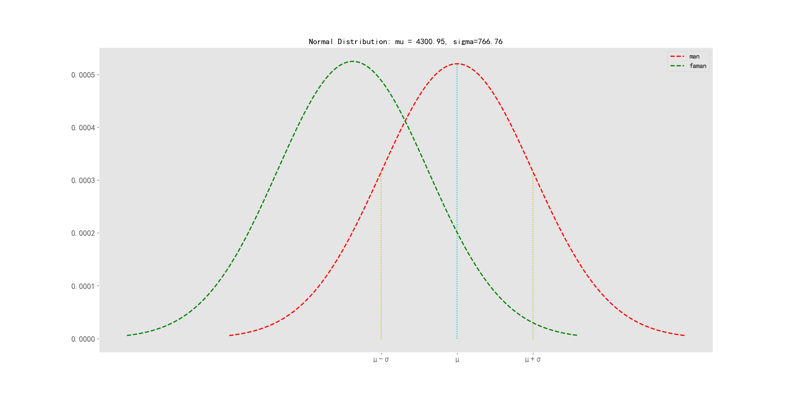
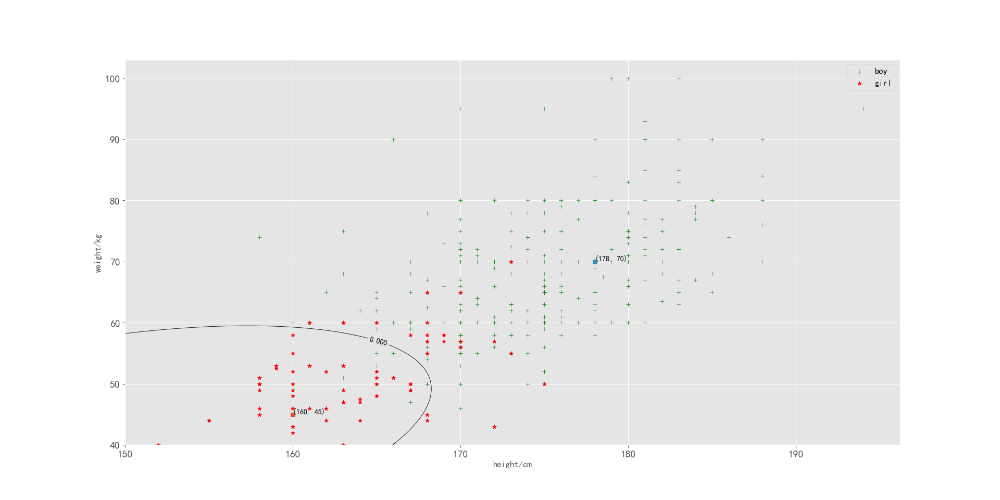

## 模式识别与机器学习第一次作业

### 孙佳伟（202122060713）

### 庄鑫平（202152011945）

**作业分配情况：**
**孙佳伟:第二部分与第四部分的代码实现与分析**
**庄鑫平:第一部分与第三部分的代码实现与分析**

[项目地址：https://github.com/sinary-sys/pattern_recognition/tree/master/%E7%AC%AC%E4%B8%80%E6%AC%A1%E4%BD%9C%E4%B8%9A](https://github.com/sinary-sys/pattern_recognition/tree/master/%E7%AC%AC%E4%B8%80%E6%AC%A1%E4%BD%9C%E4%B8%9A)

[TOC]

### 一、 以肺活量为例，画出男女生肺活量的直方图并做对比

#### 1、 表格数据的导入

使用`python`中的`pandas`库，`pandas`是专门为处理表格和混杂数据设计的。

```python
import pandas as pd
```

使用`pandas`库中的`read_excel`方法，将老师提供的excel表格读入。

```python
path = "F:\Mirror\学习资料\研一\pattern_recognition\第一次作业\作业数据_2021合成.xls"
data = pd.read_excel(path)
```

读入后的结果：

```python
      编号  性别 男1女0    籍贯  身高(cm)  体重(kg)  ...  喜欢颜色  喜欢运动  喜欢文学 喜欢数学  喜欢模式识别
0      1        1    湖北   163.0    51.0  ...     蓝     1     1  NaN     NaN
1      2        1    河南   171.0    64.0  ...     蓝     0     0  NaN     NaN
2      3        1    云南   182.0    68.0  ...     蓝     1     0  NaN     NaN
3      4        1    广西   172.0    66.0  ...     绿     0     1  NaN     NaN
4      5        1    四川   185.0    80.0  ...     蓝     0     0  NaN     NaN
..   ...      ...   ...     ...     ...  ...   ...   ...   ...  ...     ...
346  347        1  四川巴中   163.0    75.0  ...     蓝     0     0  NaN     NaN
347  348        1    北京   183.0    72.0  ...     白     0     0  NaN     NaN
348  349        1   内蒙古   170.0    60.0  ...     黄     1     0  NaN     NaN
349  350        1  四川巴中   168.0    55.0  ...     橙     1     0  NaN     NaN
350  351        1  湖南邵阳   168.0    50.0  ...     白     1     0  NaN     NaN

[351 rows x 13 columns]
```

```python
print(type(data))
```

```python
<class 'pandas.core.frame.DataFrame'>
```

读入的`data`是一个`DataFrame`类型的数据

- `DataFrame`是一个表格型的数据类型，每列值类型可以不同，是最常用的pandas对象。
- `DataFrame`既有行索引，也有列索引，它可以被看做由Series组成的字典（共用同一个索引）。
- `DataFrame`中的数据是以一个或多个二维块存放的（而不是列表、字典或别的一维数据结构）。

#### 2、导入数据的解析和肺活量绘图

```python
man_Vital_capacity = data[data['性别 男1女0'].values == 1]
man_Vital_capacity = man_Vital_capacity['肺活量']

faman_Vital_capacity = data[data['性别 男1女0'].values == 0]
faman_Vital_capacity = faman_Vital_capacity['肺活量']
```

将`男生肺活量`的列经过条件筛选读取为`man_Vital_capacity`，将`女生肺活量`的列经过条件筛选读取为`man_Vital_capacity`。

使用`matplotlib`绘图库，`matplotlib`是一个用于创建出版质量图表的桌面绘图包（主要是2D方面）

导入`matplotlib`绘图库。

```python
import matplotlib.pyplot as plt
```

```python
plt.style.use("ggplot")
# 指定分组个数
n_bins=10
fig,ax=plt.subplots(figsize=(8,5))
# 实际绘图代码与单类型直方图差异不大，只是增加了一个图例项
# 在 ax.hist 函数中先指定图例 label 名称
ax.hist([man_Vital_capacity,faman_Vital_capacity], n_bins, histtype='bar',label=list('男女'))
ax.set_title('男女生肺活量统计直方图')

```


观察图标，可以明显发现，无论是男生还是女生，肺活量大致服从一个正态分布，女生的肺活量均值大约在3000左右，男生的肺活量均值在4000左右，这样的直方图表示方法，可能会让你感觉男生处于较高肺活量的感觉，但是这个不准确的，因为，在样本数据集中，男生的数量远远大于女生的数量。因此，数据应该进行归一化处理。在特征空间中，某类样本较多分布在这类均值附近，远离均值的样本较少，一般用正态分布模型是合理的。在后续的实验分析中都将运用正态分布特性对男女生的样本进行分析。


根据归一化的统计图，可以看到男生在肺活量4000占比最高，女生在3000肺活量占比最高。

### 二、  采用最大似然估计方法，求男女生肺活量的分布参数

```python
import scipy.stats as st
man_norm = st.norm.fit(man_Vital_capacity.values)
faman_norm=st.norm.fit(faman_Vital_capacity.values)
print(man_norm,faman_norm)
```

使用`python`的`scipy`库，假设男生女生的肺活量服从正态分布，对男生和女生的肺活量求分布参数，代码如上，运行结果如下

```python
(4300.950530035336, 766.7614177550078) (3247.794117647059, 760.1970440930107)
```

由结果可知，男生的肺活量服从分布
$$
N(4300.950530035336, 766.7614177550078)
$$


女生的肺活量服从分布
$$
N(3247.794117647059, 760.1970440930107)
$$

根据求得的参数，为了更直观的看到男生和女生的肺活量概率密度，我们自定义一个产生正态分布概率密度函数的函数，画出男生和女生，关于肺活量的概率密度函数，函数定义如下

```python
# 正态分布的概率密度函数
def normpdf(x, mu, sigma):
    pdf = np.exp(-(x - mu) ** 2 / (2 * sigma ** 2)) / (sigma * np.sqrt(2 * np.pi))
    return pdf
```

使用绘图库的函数，绘制正态分布的概率密度曲线。

```python
mu, sigma = (4300.950530035336, 766.7614177550078)
x = np.arange(mu - 3 * sigma, mu + 3 * sigma, 0.01)  # 生成数据，步长越小，曲线越平滑
y = normpdf(x, mu, sigma)

mu1, sigma1 = (3247.794117647059, 760.1970440930107)
x1 = np.arange(mu1 - 3 * sigma1, mu1 + 3 * sigma1, 0.01)  # 生成数据，步长越小，曲线越平滑
y1 = normpdf(x1, mu1, sigma1)
# 概率分布曲线
plt.plot(x, y, 'r--', linewidth=2, label="man")
plt.plot(x1, y1, 'g--', linewidth=2, label="faman")
plt.title('Normal Distribution: mu = {:.2f}, sigma={:.2f}'.format(mu, sigma))

plt.vlines(mu, 0, normpdf(mu, mu, sigma), colors="c", linestyles="dotted")
plt.vlines(mu + sigma, 0, normpdf(mu + sigma, mu, sigma), colors="y", linestyles="dotted")
plt.vlines(mu - sigma, 0, normpdf(mu - sigma, mu, sigma), colors="y", linestyles="dotted")
plt.xticks([mu - sigma, mu, mu + sigma], ['μ-σ', 'μ', 'μ+σ'])
```

绘图结果如下：


从上图男女生肺活量正态分布的概率密度可以看出，在均值处，男女生的肺活量的分布人数最多。
根据最大似然估计的公式计算，对于正态分布来说，最大似然估计的均值就是样本均值，最大似然估计的方差就是样本方差，接下来计算一下样本的均值和方差，看一下是否一样。

```python
man_norm_avg = sum(man_Vital_capacity.values) / len(man_Vital_capacity.values)
faman_norm_avg = sum(faman_Vital_capacity.values) / len(faman_Vital_capacity.values)
print('男生样本均值', man_norm_avg)
print('女生样本均值', faman_norm_avg)
```

这里我们计算了样本的均值，可以发现，是一样的。方差同理，由此也验证了最大似然估计在计算正态分布参数时，第一参数μ是服从正态分布的肺活量的均值，第二个参数σ^2是此肺活量的方差。

```python
(4300.950530035336, 766.7614177550078) (3247.794117647059, 760.1970440930107)
男生样本均值 4300.950530035336
女生样本均值 3247.794117647059

Process finished with exit code 0
```


### 三、采用贝叶斯估计方法，求男女生肺活量的分布参数（方差已知，注明自己选定的参数情况）

根据正态分布的贝叶斯公式，需要根据先验知识，来确定先验的均值和方差，这里百度一下我国大学生的肺活量的均值和方差，作为我们估计的均值和方差，均值和方差分别为:`男生 3840与562mL`,`女生 2661与536mL`,

根据正态分布下的贝叶斯公式，定义贝叶斯函数

```python
def get_mean_bayes(arr, mean0, variance0, variance):
    datasum = sum(arr)
    datalen = len(arr)
    mean_bayes = (variance0 * datasum + variance * mean0) / (datalen * variance0 + variance)
    return mean_bayes
```

根据我们自己选定的参数和样本数据，求男生女生肺活量的分布参数

```python
print(get_mean_bayes(man_Vital_capacity.values, 3840, 562, 700))
print(get_mean_bayes(faman_Vital_capacity.values, 2661, 536, 700))
4298.930664930577
3236.736836438032
```

对比于最大似然估计的方法，可以发现，求取的结果大致相同。综上可知，由于贝叶斯估计是样本信息与先验信息的加权平均，反映的是先验知识与样本信息的可靠性度量。如果已知的全国大学生肺活量数据可靠的话，用贝叶斯估计的参数比第二部分用最大似然估计法估计的参数更加准确。

### 四、基于身高和体重，采用最小错误率贝叶斯决策，画出类别判定的决策面。并判断某样本的身高体重分别为(165,50)时应该属于男生还是女生？为(175,55)时呢？

基于身高和体重，

c类分类决策问题：按决策规则把d维特征空间分为 为c个决策区域，根据实际问题，进行的是男生女生的判别，因此$c_1=男,c_2=女$

决策面：划分决策域的边界面称为决策面，数学上用决策面方程表示。

判别函数：表达决策规则的函数，本次使用的是最小错误率bayes决策，因此决策函数为$$ h^*(x)=arg max P(c/x)$$

根据所给的数据，采用生成式模型先对联合概率密度$p(x,c)$建模，然后在获得$p(c/x)$。

从表中分别提取男生和女生的身高和体重数据

```python
man_height = data[data['性别 男1女0'].values == 1]
man_weight = man_height['体重(kg)']
man_height = man_height['身高(cm)']
faman_height = data[data['性别 男1女0'].values == 0]
faman_weight = faman_height['体重(kg)']
faman_height = faman_height['身高(cm)']
```

先计算类先验概率

```python
p_c1 = len(man_weight.values) / (len(man_weight.values) + len(faman_weight.values))
p_c2 = len(faman_weight.values) / (len(man_weight.values) + len(faman_weight.values))
print(p_c1, p_c2)
```

打印结果为`0.8062678062678063` `0.19373219373219372`，可知$p(c_1)=0.806$ ，$p(c_2)=0.1937$

接下来使用极大似然估计，估计男生女生的身高和体重的分布参数。

```python
man_height_mean, man_height_std = st.norm.fit(man_height.values)  # 男生升高分布参数
man_weight_mean, man_weight_std = st.norm.fit(man_weight.values)  # 男生体重分布参数
woman_height_mean, woman_height_std = st.norm.fit(faman_height.values)  # 女生升高分布参数
woman_weight_mean, woman_weight_std = st.norm.fit(faman_weight.values)  # 女生体重分布参数
print('男生身高', man_height_mean, man_height_std)
print('男生体重', man_weight_mean, man_weight_std)
print('女生身高', woman_height_mean, woman_height_std)
print('女生体重', woman_weight_mean, woman_weight_std)
男生身高 174.3374558303887 6.017355043960831
男生体重 67.30742049469964 10.328740378112387
女生身高 163.73529411764707 4.828279583560197
女生体重 51.0 6.2172672264191675
```

```python
# 求协方差矩阵
def get_covariance_matrix_coefficient(arr1, arr2):  # arr1与arr2长度相等
    datalength1 = len(arr1)
    datalength2 = len(arr2)
    sum_temp = []
    for i in range(datalength1):
        sum_temp.append((arr1[i] - sum(arr1) / datalength1) * (arr2[i] - sum(arr2) / datalength2))
        c12 = sum(sum_temp)
    covariance_matrix_c12 = c12 / (datalength1 - 1)
    return covariance_matrix_c12
```

```py
man_c11 = man_height_std ** 2
man_c22 = man_weight_std ** 2
man_c12 = man_c21 = get_covariance_matrix_coefficient(man_height.values, man_weight.values)
man_covariance_matrix = np.matrix([[man_c11, man_c12], [man_c21, man_c22]])
woman_c11 = woman_height_std ** 2
woman_c22 = woman_weight_std ** 2
woman_c12 = woman_c21 = get_covariance_matrix_coefficient(faman_height.values, faman_weight.values)
woman_covariance_matrix = np.matrix([[woman_c11, woman_c12], [woman_c21, woman_c22]])
print(man_covariance_matrix, woman_covariance_matrix)

man_feature_mean_vector = np.matrix([[man_height_mean], [man_weight_mean]])
woman_feature_mean_vector = np.matrix([[woman_height_mean], [woman_weight_mean]])
```

根据协方差矩阵的定义，求出协方差矩阵。

```python
# 定义等高线高度函数
def f(sample_height, sample_weight):
    mytemp1 = np.zeros(shape=(100, 100))
    for i in range(100):
        for j in range(100):
            sample_vector = np.matrix([[sample_height[i, j]], [sample_weight[i, j]]])
            sample_vector_T = np.transpose(sample_vector)
            # 定义决策函数
            mytemp1[i, j] = 0.5 * np.transpose(sample_vector - man_feature_mean_vector) * (
                np.linalg.inv(man_covariance_matrix)) * \
                            (sample_vector - man_feature_mean_vector) - 0.5 * np.transpose(
                sample_vector - woman_feature_mean_vector) * \
                            (np.linalg.inv(woman_covariance_matrix)) * (sample_vector - woman_feature_mean_vector) + \
                            0.5 * math.log(
                (np.linalg.det(man_covariance_matrix)) / (np.linalg.det(woman_covariance_matrix))) - \
                            math.log(p_c1 / p_c2)
    return mytemp1


sample_height = np.linspace(150, 180, 100)
sample_weight = np.linspace(40, 80, 100)
# 将原始数据变成网格数据
Sample_height, Sample_weight = np.meshgrid(sample_height, sample_weight)
# 填充颜色
plt.contourf(Sample_height, Sample_weight, f(Sample_height, Sample_weight), 0, alpha=0)
# 绘制等高线,圈内为女生，圈外为男生
C = plt.contour(Sample_height, Sample_weight, f(Sample_height, Sample_weight), 0, colors='black', linewidths=0.6)
# 显示各等高线的数据标签
plt.clabel(C, inline=True, fontsize=10)

# 显示男女生样本散点图

p1 = plt.scatter(man_height.values, man_weight.values, c='g', marker='+', linewidths=0.4)
p2 = plt.scatter(faman_height.values, faman_weight.values, c='r', marker='*', linewidths=0.4)
```

使用python库函数plt.contour画类别决策面，结果如下图所示，该模型为二维正态分布模型，决策面可以用一条等高线来表示，大部分女生样本位于等高线圈内，男生则在圈外，所以我们可以判定，落在圈内的点为女生，圈外为男生。而（165，45）打点落在圈内，判定为女生。（178，70）打点落在圈外，判定为男生。



### 五、参考文献

1. https://cloud.tencent.com/developer/article/1094425

