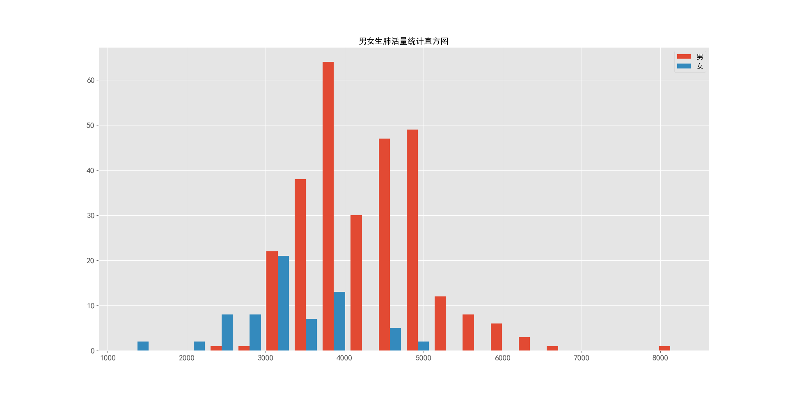
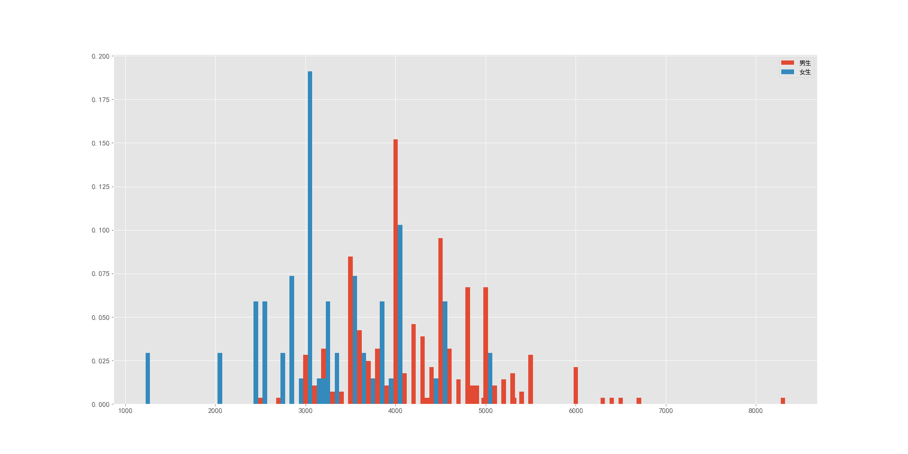

## 模式识别与机器学习第一次作业-孙佳伟（202122060713）

[项目地址：https://github.com/sinary-sys/pattern_recognition/tree/master/%E7%AC%AC%E4%B8%80%E6%AC%A1%E4%BD%9C%E4%B8%9A](https://github.com/sinary-sys/pattern_recognition/tree/master/%E7%AC%AC%E4%B8%80%E6%AC%A1%E4%BD%9C%E4%B8%9A)

[TOC]

### 一、 以肺活量为例，画出男女生肺活量的直方图并做对比

#### 1、 表格数据的导入

使用`python`中的`pandas`库，`pandas`是专门为处理表格和混杂数据设计的。

```python
import pandas as pd
```

使用`pandas`库中的`read_excel`方法，将老师提供的excel表格读入。

```python
path = "F:\Mirror\学习资料\研一\pattern_recognition\第一次作业\作业数据_2021合成.xls"
data = pd.read_excel(path)
```

读入后的结果：

```python
      编号  性别 男1女0    籍贯  身高(cm)  体重(kg)  ...  喜欢颜色  喜欢运动  喜欢文学 喜欢数学  喜欢模式识别
0      1        1    湖北   163.0    51.0  ...     蓝     1     1  NaN     NaN
1      2        1    河南   171.0    64.0  ...     蓝     0     0  NaN     NaN
2      3        1    云南   182.0    68.0  ...     蓝     1     0  NaN     NaN
3      4        1    广西   172.0    66.0  ...     绿     0     1  NaN     NaN
4      5        1    四川   185.0    80.0  ...     蓝     0     0  NaN     NaN
..   ...      ...   ...     ...     ...  ...   ...   ...   ...  ...     ...
346  347        1  四川巴中   163.0    75.0  ...     蓝     0     0  NaN     NaN
347  348        1    北京   183.0    72.0  ...     白     0     0  NaN     NaN
348  349        1   内蒙古   170.0    60.0  ...     黄     1     0  NaN     NaN
349  350        1  四川巴中   168.0    55.0  ...     橙     1     0  NaN     NaN
350  351        1  湖南邵阳   168.0    50.0  ...     白     1     0  NaN     NaN

[351 rows x 13 columns]
```

```python
print(type(data))
```

```python
<class 'pandas.core.frame.DataFrame'>
```

读入的`data`是一个`DataFrame`类型的数据

- `DataFrame`是一个表格型的数据类型，每列值类型可以不同，是最常用的pandas对象。
- `DataFrame`既有行索引，也有列索引，它可以被看做由Series组成的字典（共用同一个索引）。
- `DataFrame`中的数据是以一个或多个二维块存放的（而不是列表、字典或别的一维数据结构）。

#### 2、导入数据的解析和肺活量绘图

```python
man_Vital_capacity = data[data['性别 男1女0'].values == 1]
man_Vital_capacity = man_Vital_capacity['肺活量']

faman_Vital_capacity = data[data['性别 男1女0'].values == 0]
faman_Vital_capacity = faman_Vital_capacity['肺活量']
```

将`男生肺活量`的列经过条件筛选读取为`man_Vital_capacity`，将`女生肺活量`的列经过条件筛选读取为`man_Vital_capacity`。

使用`matplotlib`绘图库，`matplotlib`是一个用于创建出版质量图表的桌面绘图包（主要是2D方面）

导入`matplotlib`绘图库。

```python
import matplotlib.pyplot as plt
```

```python
plt.style.use("ggplot")
# 指定分组个数
n_bins=10
fig,ax=plt.subplots(figsize=(8,5))
# 实际绘图代码与单类型直方图差异不大，只是增加了一个图例项
# 在 ax.hist 函数中先指定图例 label 名称
ax.hist([man_Vital_capacity,faman_Vital_capacity], n_bins, histtype='bar',label=list('男女'))
ax.set_title('男女生肺活量统计直方图')

```



观察图标，可以明显发现，无论是男生还是女生，肺活量大致服从一个正态分布，女生的肺活量均值大约在3000左右，男生的肺活量均值在4000左右，这样的直方图表示方法，可能会让你感觉男生处于较高肺活量的感觉，但是这个不准确的，因为，在样本数据集中，男生的数量远远大于女生的数量。因此，数据应该进行归一化处理。



根据归一化的统计图，可以看到男生在肺活量4000占比最高，女生在3000肺活量占比最高。

### 二、  采用最大似然估计方法，求男女生肺活量的分布参数

```python
import scipy.stats as st
man_norm = st.norm.fit(man_Vital_capacity.values)
faman_norm=st.norm.fit(faman_Vital_capacity.values)
print(man_norm,faman_norm)
```

使用`python`的`scipy`库，假设男生女生的肺活量服从正态分布，对男生和女生的肺活量求分布参数，代码如上，运行结果如下

```python
(4300.950530035336, 766.7614177550078) (3247.794117647059, 760.1970440930107)
```

由结果可知，男生的肺活量服从分布
$$
N(4300.950530035336, 766.7614177550078)
$$


女生的肺活量服从分布
$$
N(3247.794117647059, 760.1970440930107)
$$


### 三、采用贝叶斯估计方法，求男女生肺活量的分布参数（方差已知，注明自己选定的参数情况）

### 四、基于身高和体重，采用最小错误率贝叶斯决策，画出类别判定的决策面。并判断某样本的身高体重分别为(165,50)时应该属于男生还是女生？为(175,55)时呢？
